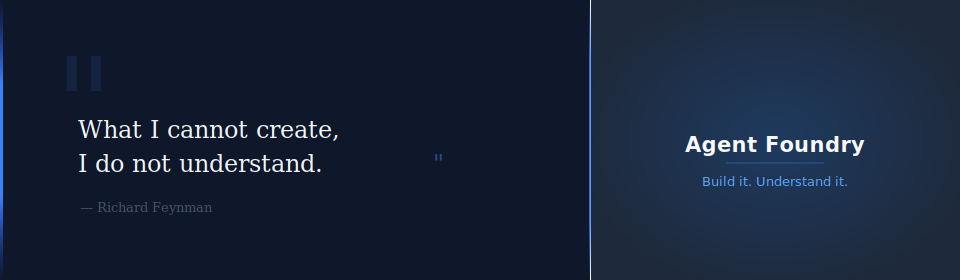
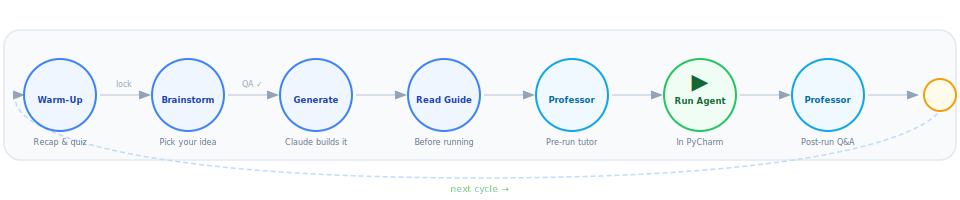

<div align="center">



[![PRD Version][prd-shield]][prd-link]
[![Python][python-shield]][python-link]
[![Platform][platform-shield]][platform-link]
[![Status][status-shield]][status-link]

**Agent Foundry teaches you how AI agents work by having you build one — in every session, with an AI tutor at your side. You describe an idea. Claude builds the agent, explains it to you, and then quizzes you on what you saw when it ran. No coding experience required to get started.**

</div>

---



---

<details>
<summary><kbd>Table of Contents</kbd></summary>

- [What is an AI agent?](#-what-is-an-ai-agent)
- [What does Agent Foundry do?](#-what-does-agent-foundry-do)
- [Your AI tutor](#-your-ai-tutor-the-professor)
- [What you will produce](#-what-you-will-produce)
- [What you will learn](#-what-you-will-learn-by-the-end)
- [What one session looks like](#-what-one-session-looks-like)
- [Is this for me?](#-is-this-for-me)
- [What you need](#-what-you-need)
- [How to start](#-how-to-start)
- [Honest caveats](#-honest-caveats)

</details>

---

## 🤖 What is an AI agent?

Most people know AI as something that answers questions — you ask, it replies. An **AI agent** is different. It can:

- **Set itself a goal** — like "find and summarise the top three tech stories today"
- **Decide what to do next** — not following a fixed script, but choosing based on what it finds
- **Use tools** — search the web, read files, call APIs
- **Check whether it's finished** — and keep going until it is

The difference between a chatbot and an agent is like the difference between a vending machine and a personal assistant. The vending machine does exactly what you press. The assistant figures out what you need and takes steps to get it done.

Agent Foundry builds you one of these. Then it explains, step by step, exactly what the agent did and why.

<div align="right">

[back to top](#-agent-foundry)

</div>

---

## 🏗️ What does Agent Foundry do?

It turns your daily-life ideas into real, running AI agents — and teaches you what makes them tick.

Here is the experience in plain English:

1. **You describe an idea.** Something from daily life: "I want an agent that reads the top tech news each morning and gives me a three-sentence summary." No technical spec needed.

2. **Claude proposes it back to you — with an honest evaluation.** It tells you whether your idea qualifies as a true agent (with reasons), and suggests 3–4 candidates ranked by how much new learning each one would introduce.

3. **Claude builds everything.** All the code, all the tests, all the documentation. You do not write a single line. A full "learning kit" of 8 files lands in your project folder.

4. **You read the guide first, then run the agent.** A visual guide (an HTML file you open in your browser) explains what you are about to see — in plain English — before you run anything. Then you run the agent in PyCharm with one click.

5. **Your AI tutor checks in.** Before your run, the Professor explains the key ideas. After your run, the Professor asks you questions about specific lines from your output — not from memory, from evidence you can point to on screen.

6. **A second guide is generated from your actual run.** It quotes lines from what your agent printed and explains why each one proves the agent was thinking, deciding, and working toward a goal — not just following a script.

> Every session builds on the last. By your fifth session, you have five agents, each more capable than the one before, and a growing ability to look at *any* agent and explain what it is doing and why.

<div align="right">

[back to top](#-agent-foundry)

</div>

---

## 🎓 Your AI Tutor — The Professor

Every session includes a built-in AI tutor called the Professor. It has two jobs.

### Before you run — the preview conversation

The Professor explains what you are about to see:

- What goal the agent is trying to reach
- What decisions the agent will make on its own (versus what the code forces it to do)
- One or two things to watch for in the output
- What was discussed in your last session — a quick "what do you remember?" before you start something new

This takes about 5–10 minutes. It is a conversation, not a lecture. You can skip it if you are in a hurry.

### After you run — the debrief

After you say **"I ran it"** in Claude Desktop, the Professor comes back.

This time, every question is anchored to your actual output:

> *"Find the line that says* `[MODEL DECISION]` *in your terminal. Who made that choice — your Python code, or the AI? How do you know?"*

You are not being asked to recite a definition. You are being asked to point to evidence. This is why the post-run conversation is usually more useful than the pre-run one — you have something real to look at.

The Professor never scores you. There are no grades, no pass/fail, no rubrics. If you get something wrong, you get one follow-up question pointing you to the right line. Then the explanation. Then you move on.

<div align="right">

[back to top](#-agent-foundry)

</div>

---

## 📦 What you will produce

Every session generates a complete "learning kit" in a folder. Here is what you get, in plain English:

| What it is | What it does |
|---|---|
| 📄 **The blueprint** (`prompt.md`) | The plain-English spec Claude used to build your agent. Read this first if you want to understand the design decisions. |
| 📖 **The pre-run guide** (`_learning-guide.html`) | A beautifully formatted HTML file you open in your browser. Explains what the agent does, why it qualifies as an agent, and what to watch for when it runs. Includes a short quiz. |
| 🐍 **The agent itself** (`main.py`) | The Python program that runs your agent. One click in PyCharm. |
| 🧪 **The test** (`smoke_test.py`) | An automated test Claude runs to make sure the agent works before handing it over. You don't need to touch this. |
| 📋 **The run log** (`_run_output.log`) | Everything your agent printed when it ran — saved automatically. The post-run guide is built from this file. |
| ✨ **The post-run insights** (`_learning-insights.html`) | Generated after your first run. Quotes actual lines from your log to prove — with evidence — that your agent was genuinely making decisions, not just following a script. Includes flashcards and a quiz built from *your specific run*. |

After five sessions you will have five complete kits, each introducing a new capability.

<div align="right">

[back to top](#-agent-foundry)

</div>

---

## 🧭 What you will learn by the end

You do not need to become a programmer to get value from Agent Foundry. Here is what you will be able to do after five sessions, in plain English:

**After session 1:**
You can explain, from your actual terminal output, what your agent was trying to do, when it made a decision, and when the Python code made the decision instead.

**After session 2:**
You can describe the difference between an agent that starts fresh every time it calls the AI versus one that remembers what it said before.

**After session 3:**
You can point to a line in the output called `[MODEL DECISION]` and explain exactly why the AI — not the code — chose that action. You can articulate why this matters.

**After session 4:**
You can explain what it means for an agent to verify its own work using a separate AI call, and why that is different from just checking your own answer.

**After session 5:**
You can look at any agent you encounter — in a product, an article, or a job interview — and identify whether it is a real agent or just a script with an AI label on it. You will have a framework and the vocabulary to back your judgment up.

<div align="right">

[back to top](#-agent-foundry)

</div>

---

## 🗓️ What one session looks like

A typical session takes 30–60 minutes depending on how deeply you engage with the Professor.

```
You open Claude Desktop and say: "new agent"
         │
         ▼
🧠  The Professor recaps what you built last time
    and asks you 2–3 questions about it
         │
         ▼
💭  Claude proposes 3–4 agent ideas based on your interests
    You pick one (or bring your own idea)
         │
         ▼
⚙️  Claude builds all 8 files — you watch, ask questions
    Claude runs its own tests before handing over
         │
         ▼
📖  You read the pre-run guide in your browser (≈10 min)
         │
         ▼
🎓  Optional: the Professor explains what you're about to see
         │
         ▼
▶   You run the agent in PyCharm with one click
    Your terminal fills with labeled, annotated output
    The result appears at the end
         │
         ▼
🎓  You say "I ran it" — the Professor asks 3–5 questions
    about lines from your actual output
         │
         ▼
✨  Claude generates your post-run insights guide
    from your real run log
```

<div align="right">

[back to top](#-agent-foundry)

</div>

---

## 🙋 Is this for me?

**You will get the most out of Agent Foundry if:**
- You are genuinely curious about AI agents and want more than a surface-level explanation
- You are comfortable running a program from a menu — the equivalent of pressing Play
- You are willing to have a 10-minute conversation with an AI tutor about what you just saw
- You do not need to build agents yourself right now — you want to understand how they work

**You will not get much out of it if:**
- You want to be guided passively — the Professor will ask you questions, and you need to engage with them
- You want to modify or extend the generated agents — that requires Python knowledge this project does not teach

**On coding:** You do not need to know Python to run the agents or follow the guides. The pre-run guide includes a "Python Reading Primer" — five concepts you need to recognise (not write) to follow the code. If you can read a recipe, you can follow the guide.

<div align="right">

[back to top](#-agent-foundry)

</div>

---

## 🔧 What you need

| Requirement | Details |
|---|---|
| **Claude Desktop** | Free to download — [claude.ai](https://claude.ai). Requires a **Claude Max plan** subscription (the agents authenticate through your account — no separate API key) |
| **Claude Code CLI** | The command-line tool Claude uses to run agents. Install it from Claude Desktop settings. Verify with `claude auth status` in your terminal |
| **PyCharm** | Free (Community edition). Where you run the generated agents — one right-click, then Run |
| **Python 3.12+** | Free. Install from [python.org](https://www.python.org/downloads/) |
| **Windows** | The agents are tested on Windows. macOS would likely work but is not officially supported here |

> [!IMPORTANT]
> This project never uses a paid API key. Everything runs through your Claude Max subscription. If you see something asking for `ANTHROPIC_API_KEY`, something has gone wrong — the generated agents will warn you and stop.

<div align="right">

[back to top](#-agent-foundry)

</div>

---

## 🚀 How to start

**Step 1 — Get the project**

```bash
git clone https://github.com/ramnathmur/agent-foundry.git
```

Or download the ZIP from the green **Code** button above.

**Step 2 — Open it in Claude Desktop**

Open Claude Desktop. Go to **Settings → Projects → New Project** and point it at the folder you just downloaded. Claude reads the project files automatically when the project opens.

**Step 3 — Say two words**

```
new agent
```

That's it. Claude takes it from there — reading your learning history (if any), warming you up, and asking what kind of agent you want to build today.

> [!NOTE]
> On your very first session there is no history to warm up on, so you go straight to the brainstorm. From session 2 onward, the Professor starts every session with a 5-minute recap of what you built and learned last time.

<div align="right">

[back to top](#-agent-foundry)

</div>

---

## ⚠️ Honest caveats

**This is a personal learning project, not a product.** It was built for one person (Ram) and one setup (Windows + PyCharm + Claude Desktop). If something does not work on your machine, you are on your own — there is no support channel, no issue tracker, no community.

**The agents do real things.** The generated agents can call public web APIs, read and write files, and run in loops. They are designed with safety limits (they always have a maximum number of steps and will stop) but you should understand what each agent does before running it. Read the pre-run guide.

**The AI tutor is an AI.** The Professor is not a human. It will not notice if you are confused in ways you cannot articulate. If something is not clicking, the most effective thing to do is say so directly: "I don't understand what [LOOP FEEDBACK] means" — and the Professor will explain from your specific output.

**You need Claude Max.** The agents use the Claude Agent SDK, which requires a Max plan subscription. There is no free tier option for running the agents.

**The learning compounds slowly.** Session 1 teaches you relatively little — there is not much to compare to. The real value starts at session 3, when you can contrast what you are building now against what you built before. Commit to at least three sessions before deciding whether this is working for you.

<div align="right">

[back to top](#-agent-foundry)

</div>

---

<div align="center">

Want to understand AI agents from the inside out? **Say `new agent` in Claude Desktop.**

_Built with [Claude Code](https://claude.ai/code) · Personal project · 2026_

</div>

<!-- Link reference definitions -->
[prd-shield]: https://img.shields.io/badge/PRD-v9-blue?style=flat-square
[prd-link]: ./PRD.md
[python-shield]: https://img.shields.io/badge/Python-3.12%2B-3776ab?style=flat-square&logo=python&logoColor=white
[python-link]: https://www.python.org/downloads/
[platform-shield]: https://img.shields.io/badge/Platform-Windows%20%2B%20PyCharm-0078d4?style=flat-square&logo=windows&logoColor=white
[platform-link]: https://www.jetbrains.com/pycharm/
[status-shield]: https://img.shields.io/badge/Status-Active%20Development-22c55e?style=flat-square
[status-link]: ./ROADMAP.md
